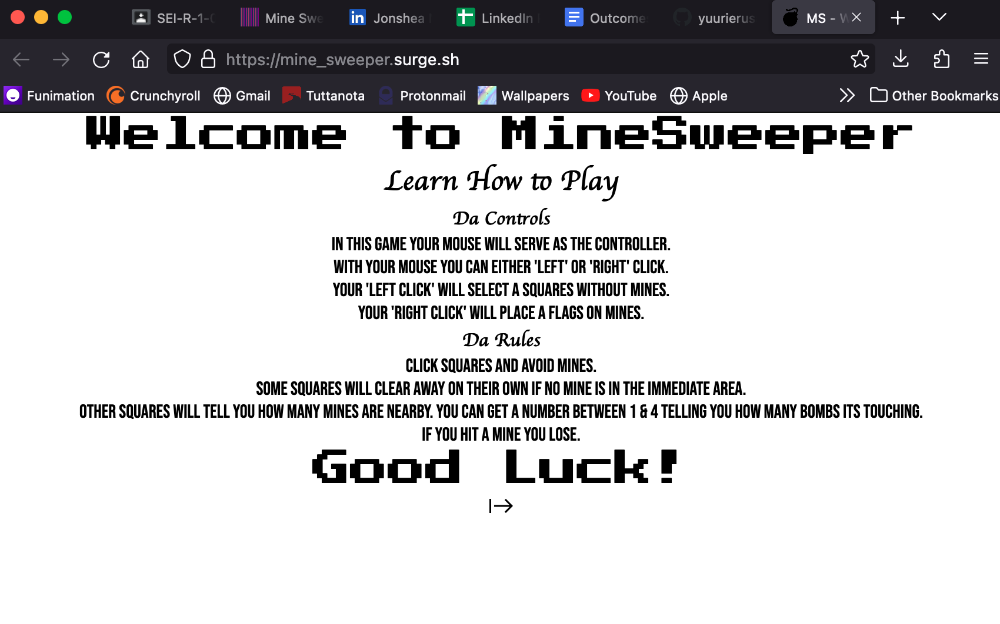
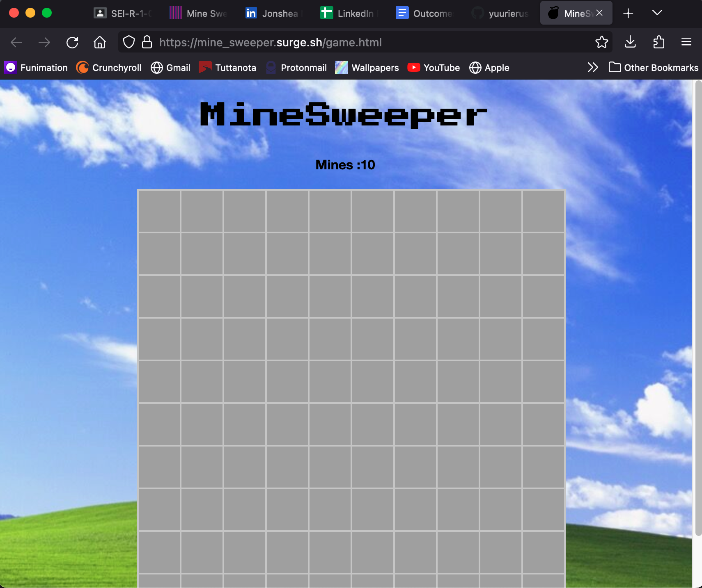

## Date: 01/20/2023

### By: Jonshea Nutson

#### [GitHub](https://github.com/yuurierusan) | [LinkedIn](https://linkedin.com/jonshean)

---

### **_Description_**

#### This project features a clone of the classic game Minesweeper. Mine sweeper is a logic-based computer game played with the task of locating a predetermined number of randomly-placed "mines". You click on squares & try to avoid squares with mines.

---

### **_Technologies Used_**

-   Warp Terminal
-   VS Code
    -   TBA

1. Github
2. Window 98
    - Minesweeper (1989)

---

### **_Getting Started_**

##### Once the game is complete you'll be able to access and play it [here](mine_sweeper.surge.sh).

##### A Trello board was used to keep track of development progress and can be viewed [here](https://trello.com/invite/b/Mj5DHgBr/ATTIb4dc15ec67bb081751fae57d9b1b95890E937067/mine-sweeper).

##### The project itself was deployed and can be viewed [here](https://github.com/yuurierusan/Mine_Sweeper).

---

### **_Screenshots_**

---

### **_Task List_**

-   [x] Build a browser-based game utilizing HTML/CSS/JavaScript
-   [x] Include 2 HTML pages
-   [x] Include 2 event handlers
-   [x] Theme around the original Minesweeper i played years ago
-   [x] Have a status text showing time since start
-   [x] A grid/flex box with clickable tiles
-   [x] Have numbers appear in the grid tiles in relation to how far the bomb is from the players choice
-   [x] Have tiles change color or image depending on which tile is clicked and if its a bomb or a number
-   [x] Have a win and los check as well as status text to show if you have won or lost the game.

---

### **_Future Features_**

-   TBA

---

### **_Credits_**

## Contributors: [People] Classmates, Teachers, TA's

## Markdown Guide: [General Assembly](https://github.com/yuurierusan/u1_hw_markdown)

## Images: [Google Search](https://google.com)

## Task Manager: [Trello](https://trello.com/)

## Web Publishing: [Surge](https://surge.sh)

## Depth First Search Research: [Dev](https://dev.to/akhilpokle/number-of-islands-implementing-depth-first-search-with-the-help-of-minesweeper-507g)

## Set Attributes: [Stack Overflow](https://stackoverflow.com/questions/14860094/set-data-attribute-on-div-with-js)

## How to Play: [WikiHow](https://www.wikihow.com/Play-Minesweeper)

## Logic of Minesweeper [OpenGenus](https://iq.opengenus.org/minesweeper-game-using-js/)

## Fonts and Buttons [Google Fonts](https://fonts.google.com/)
